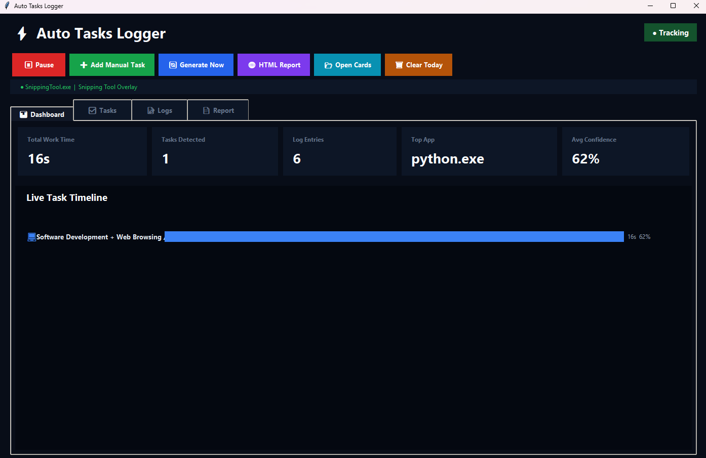
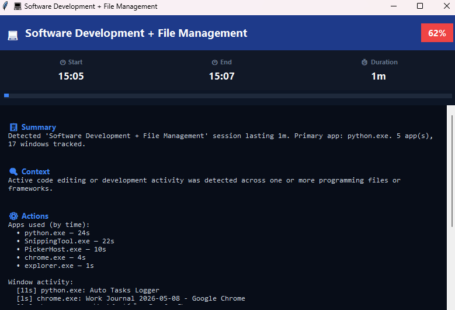
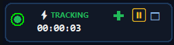
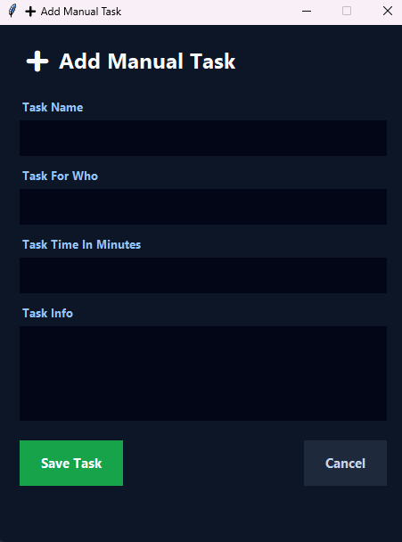

# ⚡ Employee-Tasks-Manager

Smart Python desktop application that automatically tracks employee activity, detects work tasks, generates reports, and visualizes productivity with live dashboards and timelines.

---

# 🚀 Features

* ✅ Automatic task detection
* ✅ Active application & window tracking
* ✅ Smart work session grouping
* ✅ Floating quick-access widget
* ✅ Manual task creation
* ✅ Live dashboard and timeline
* ✅ HTML report generation
* ✅ SQLite local database
* ✅ Fully offline
* ✅ Real-time productivity monitoring

---

# 🖥 Supported Work Types

The application can automatically detect and categorize tasks such as:

* 💻 Software Development
* 🗄 Database Work
* 🌐 Network / Firewall Configuration
* 📞 VOIP / PBX Setup
* 🖥 Remote Support Sessions
* ⚙ Linux / Server Administration
* 📧 Helpdesk / Email Tasks
* 📄 Documentation & Reports

---

# 📸 Screenshots

## Dashboard

<p align="center">
  
</p>

---

## Tasks & Activity Tracking

<p align="center">
  
</p>

---

## Floating Widget

<p align="center">
  
</p>

---


## Manual Task Creation

<p align="center">
  
</p>

---

# 🛠 Built With

* Python
* Tkinter
* SQLite
* psutil

---

# 📦 Installation

Clone the repository:

```bash
git clone https://github.com/MustafaMadeeh/Employee-Tasks-Manager.git
cd Employee-Tasks-Manager
```

Install dependencies:

```bash
pip install psutil
```

Run the application:

```bash
python main.py
```
 

💾 Windows Executable

A ready-to-use Windows executable version is included:

Auto Tasks Logger.exe

You can run the application directly without installing Python.

```

# 📊 Reports

The application automatically generates:

* Daily work reports
* Activity logs
* Task summaries
* Productivity timelines
* HTML visual reports

Reports are saved locally inside:

```text
/reports
```

---

# ⚡ Floating Widget

The app includes a smart floating widget that allows:

* Start / Pause tracking
* Open dashboard
* Quick manual task creation

---


# 🔒 Privacy

All tracking and reports are processed locally on your machine.

No cloud services, APIs, or external servers are used.

---

# 👨‍💻 Developer

Developed by Mustafa Madeeh

GitHub:
https://github.com/MustafaMadeeh
